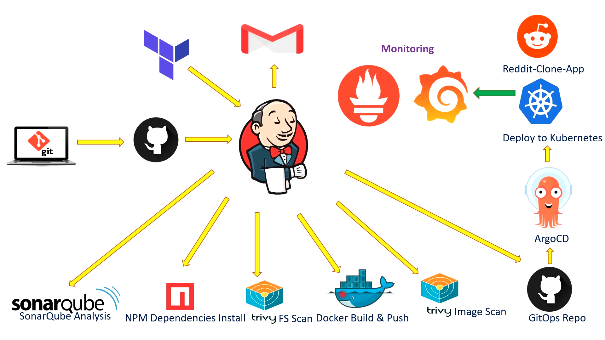

# PFS-DevOps-pipeline
 
## Architecture Diagram

## Jenkins:
  ### Jenkins plugins:
  - eclipse => Eclipse Temurin installerVersion
  - sonarqube => SonarQube Scanner
  - gates => Sonar Quality Gates
  - node js => NodeJS
  - docker => Docker, Docker Commons, Docker Pipeline, Docker API, docker-build-step, CloudBees Docker Build and Publish.
  ### Jenkins tools:
  - nodejs => choose the best version for you
  - JDK => Install from adoptium.net => choose the version
  - docker => Download from docker.com => keep the latest version
  - sonarqube scanner => Install from Maven Central => keep the default version
## Sonarqube 
  ## Sonarqube installation using Docker:
    'docker run -d --name sonar -p 9000:9000 sonarqube:lts-community'
  ## Configure SonarQube with Jenkins:
   ### Add Credentials
   Sonarqube web UI: Go to:  Administration -> Security -> Users -> Tokens, add a name, then generate a token, then copy it.
   Jenkins web UI: Go to: Manage Jenkins -> Credentials -> Add Credentials -> Kind:Secret text -> secret:<your-token> -> ID:SonarQube-Token
   ### Add SonarQube server in Jenkins:
   Manage Jenkins -> System -> SonarQube installations -> add a name -> Server URL: http://192.168.3.164:9000 -> Server authentication token: Choose your token
  ## Create Quality Gates in SonarQube:
  Quality Gates -> create -> Add a name <SonarQube-Quality-Gate>
  ## Add webhook in SonarQube:
  Administration -> Configuration -> webhooks -> create -> URL: http://192.168.3.164:8080/sonarqube-webhook/
## Jenkins Pipeline:

  
