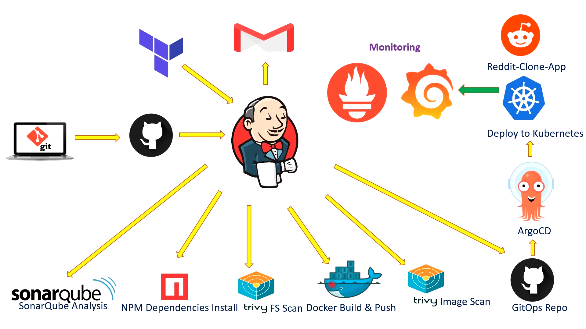

# PFS-DevOps-pipeline
 
## Architecture Diagram

## Jenkins:
  ### Jenkins plugins:
  - eclipse => Eclipse Temurin installerVersion
  - sonarqube => SonarQube Scanner
  - gates => Sonar Quality Gates
  - node js => NodeJS
  - docker => Docker, Docker Commons, Docker Pipeline, Docker API, docker-build-step, CloudBees Docker Build and Publish.
  ### Jenkins tools:
  - nodejs =>
     - name: node16
     - version: NodeJS 16.2.0
  - JDK => Install from adoptium.net => Install from adoptium.net
     - name: jdk17
     - version: jdk-17.0.8.1+1
  - docker => Download from docker.com => Download from docker.com
     - name: docker
     - version: latest
  - sonarqube scanner => Install from Maven Central => keep the default version
     - name: sonar-scanner
## SonarQube 
  ## Sonarqube installation using Docker:
    docker run -d --name sonar -p 9000:9000 sonarqube:lts-community
    
  ## Configure SonarQube with Jenkins:
   ### Add Credentials
   Sonarqube web UI: Go to:  Administration -> Security -> Users -> Tokens, name:token-for-jenkins, then generate a token, then copy it.
   Jenkins web UI: Go to: Manage Jenkins -> Credentials -> Add Credentials -> Kind:Secret text -> secret:<your-token> -> ID:SonarQube-Token
   ### Add SonarQube server in Jenkins:
   Manage Jenkins -> System -> SonarQube installations -> name:SonarQube-Server -> Server URL: http://192.168.3.164:9000 -> Server authentication token: Choose your token
   
  ## Create Quality Gates in SonarQube:
  Quality Gates -> create -> name:SonarQube-Quality-Gate
  
  ## Add webhook in SonarQube:
  Administration -> Configuration -> webhooks -> create -> name:jenkins, URL: http://192.168.3.164:8080/sonarqube-webhook/
  
## ADD GitHub credentials in Jenkins
 Go to Your GitHub -> Settings -> Developer Settings -> Personal access tokens -> Generate a token and copy it.
 Go to Jenkins -> Manage Jenkins -> Credentials -> Add Credentials -> Kind: Username with password ->Username:  
 <Your-github-username> Password: <Your-token> -> ID:github 
 
## Add DockerHub credentials in Jenkins
  Go to DockerHub -> Account Settings -> Security -> New Access Token -> Generate a token and copy it.
  Go to Jenkins -> Manage Jenkins -> Credentials -> Add Credentials -> Kind: Username with password ->Username:  
 <Your-DokerHub-username> Password: <Your-token> -> ID:dockerhub
 
## Add the Project on SonarQube:
  Go to SonarQube -> Projects -> Manually -> name:PFS-CICD -> Setup -> Locally -> Generate -> Continue -> Choose your build and your OS 
  
## Jenkins Pipeline:
  ### Add item in Jenkins
  Go to Jenkins -> New item -> name:PFS-CICD -> choose Pipeline -> Discard old builds -> Max # of builds to keep: 2 -> Script:
  
     pipeline {
     agent any
     tools {
         jdk 'jdk17'
         nodejs 'node16'
     }
     environment {
         SCANNER_HOME = tool 'sonar-scanner'
     }
     stages {
         stage('clean workspace') {
             steps {
                 cleanWs()
             }
         }
     stage('Checkout from Git') {
             steps {
                 git branch: 'main', url: 'https://github.com/iliass-bamghari/PFS.git'
             }
         }
         stage("Sonarqube Analysis") {
             steps {
                 script {
                     bat "sonar-scanner.bat -Dsonar.projectKey=PFS-CI -Dsonar.sources=. -Dsonar.host.url=http://192.168.3.164:9000 -Dsonar.login=sqp_bb5ca4e8bdba5d4ffe4657089e36f6b4c354ef69"
                 }
             }
         }
         stage("Quality Gate") {
             steps {
                 script {
                     waitForQualityGate abortPipeline: false, credentialsId: 'SonarQube-Token'
                 }
             }
         }
         stage('Install Dependencies') {
             steps {
                 sh "npm install"
             }
         }
          stage("Docker Build & Push"){
              steps{
                  script{
                    withDockerRegistry(credentialsId: 'dockerhub', toolName: 'docker'){   
                       sh "docker build -t PFS-pipeline ."
                       sh "docker tag PFS-pipeline iliassbamghari/PFS-pipeline:latest "
                       sh "docker push iliassbamghari/PFS-pipeline:latest "
                     }
                 }
             }
         }
     }
    }    
       
       

  
